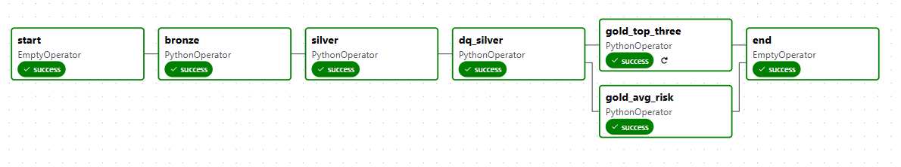

## Visão Geral

Este projeto implementa um pipeline de dados ponta a ponta para processar transações de fraude de crédito. A solução é orquestrada pelo Apache Airflow, totalmente containerizada com Docker, e utiliza o DuckDB como motor de processamento analítico.

O pipeline segue a arquitetura Medalhão, transformando os dados através das seguintes camadas:
* **Landing**: Onde os dados brutos são recebidos.
* **Bronze**: Ingestão dos dados brutos em um formato mais estruturado.
* **Silver**: Aplicação de regras de limpeza, padronização e enriquecimento.
* **Data Quality**: Uma tarefa customizada que executa testes de qualidade de dados na camada Silver. Se os testes falharem, o pipeline é interrompido.
* **Gold**: Criação de tabelas agregadas e prontas para consumo por dashboards ou análises de negócio.

## Arquitetura e Tecnologias

* **Orquestração**: Apache Airflow
* **Containerização**: Docker
* **Processamento de Dados**: DuckDB
* **Qualidade de Dados**: Processo customizado para analise de qualidade dos dados, feito com Python/DuckDB.

## Estrutura do Projeto

O projeto está organizado da seguinte forma para garantir modularidade e clareza:

```
airflow-docker-loc/
├── .storage/
│   ├── db/
│   │   └── fraud_credit.db      # Banco de dados DuckDB será criado aqui
│   └── landing/
│       └── df_fraud_credit.csv  # O arquivo de dados de entrada DEVE ser colocado aqui
├── dags/
│   └── fraud_credit_pipeline/
│       ├── __init__.py
│       ├── tasks/               # Lógica de negócio de cada tarefa
│       │   ├── __init__.py
│       │   ├── bronze_fraud_credit.py
│       │   ├── data_quality.py
│       │   ├── gold_avg_risk_fraud_credit.py
│       │   ├── gold_top_three_fraud_credit.py
│       │   └── silver_fraud_credit.py
│       └── flow.py              # Arquivo de orquestração da DAG
├── logs/                        
├── plugins/                     
├── .env                         
├── Dockerfile                    
├── docker-compose.yaml          
└── requirements.txt            
```

## Pré-requisitos
* [Python 3.11](https://www.python.org/downloads/)
* [Docker](https://www.docker.com/products/docker-desktop/)

## Como Executar

Siga estes passos para configurar e iniciar o ambiente completo do Airflow.

### 1. Coloque o Arquivo de Dados

**Importante:** Antes de iniciar, você **deve** colocar seu arquivo de dados brutos na pasta correta.

* Nome do arquivo esperado: `df_fraud_credit.csv`
* Localização: `./.storage/landing/`

### 2. Configure as Permissões de Usuário

Para evitar problemas de permissão de arquivos entre seu computador e os contêineres, crie um arquivo `.env`.

* **Para Linux ou macOS:**
    ```bash
    echo -e "AIRFLOW_UID=$(id -u)" > .env
    ```
* **Para Windows (PowerShell):**
    ```powershell
    echo "AIRFLOW_UID=50000" > .env
    ```
* Neste projeto deixarei disponível o .env base.

### 3. Construa a Imagem e Inicie os Contêineres

Este processo irá construir sua imagem customizada do Airflow (com DuckDB instalado) e iniciar todos os serviços.

1.  **Construa a imagem (recomendado usar `--no-cache` na primeira vez):**
    ```bash
    docker-compose build --no-cache
    ```
2.  **Inicie todos os serviços em segundo plano:**
    ```bash
    docker-compose up -d
    ```

### 4. Acesse a Interface do Airflow

* Abra seu navegador e acesse: `http://localhost:8080`
* Use as credenciais padrão para fazer login:
    * **Usuário**: `airflow`
    * **Senha**: `airflow`

### 5. Execute a DAG

Na interface do Airflow, procure pela DAG chamada `fraud_credit_pipeline`. Ative-a no botão de toggle e clique no botão Trigger para iniciar uma execução manual.

## Detalhes do Pipeline

O fluxo da DAG `fraud_credit_pipeline` executa as seguintes tarefas em ordem:
1.  **bronze**: Lê o arquivo CSV de `.storage/landing` e cria a tabela `bronze_transactions` no arquivo DuckDB.
2.  **silver**: Lê a tabela `bronze_transactions`, aplica limpezas, transformações e cria a tabela `silver_transactions`.
3.  **dq_silver**: Executa uma série de testes de qualidade de dados (definidos em `tasks/data_quality.py`) na tabela `silver_transactions`. **Se qualquer teste falhar, o pipeline inteiro para.**
4.  **gold_avg_risk** & **gold_top_three**: Se os testes de qualidade passarem, estas tarefas rodam em paralelo para criar as tabelas agregadas finais.



## Como Parar o Ambiente

Para parar todos os contêineres do Airflow, execute:
```bash
docker-compose down
```